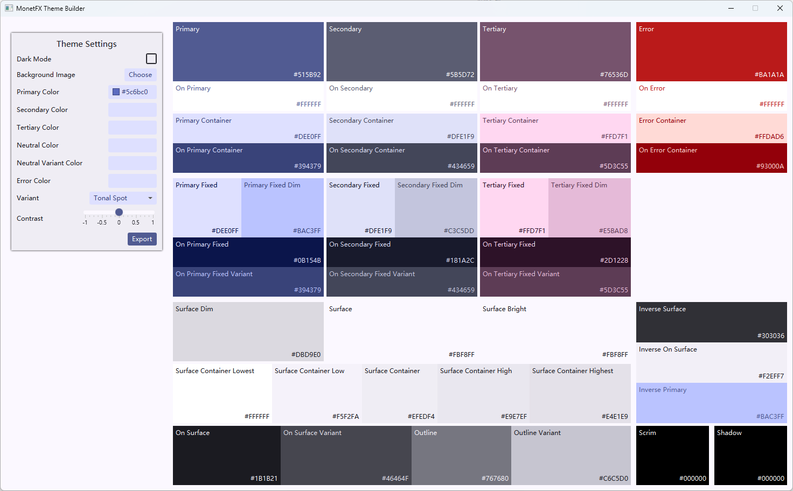
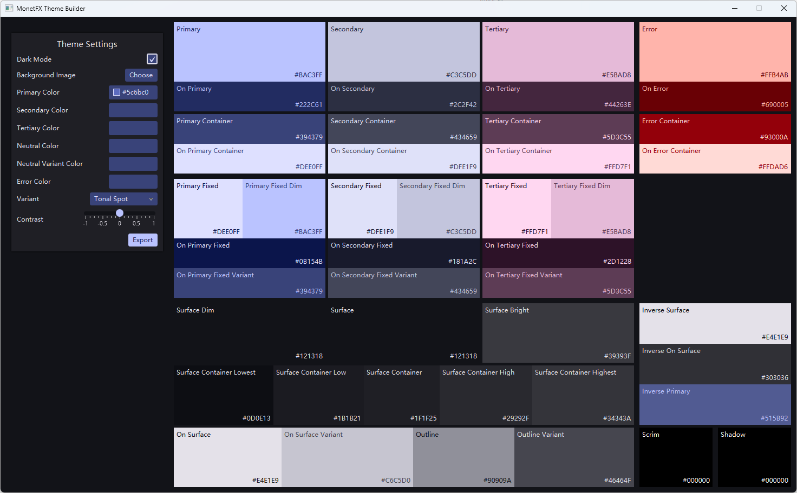
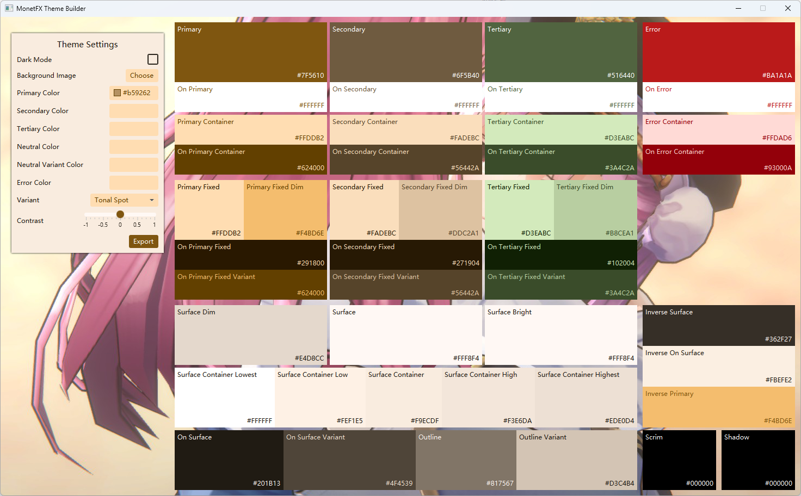

# MonetFX

[](https://search.maven.org/artifact/org.glavo/MonetFX)
[](https://javadoc.io/doc/org.glavo/MonetFX)

MonetFX provides support for the [Material 3 color system](https://m3.material.io/styles/color/system/overview) for JavaFX.
We also implemented a theme builder based on this library as an open source replacement for Material Theme Builder.

MonetFX requires JavaFX 8~25 (and higher).

This project is currently in beta and may undergo breaking changes in the future.

## MonetFX Theme Builder

MonetFX Theme Builder is a sample application for MonetFX and an open source alternative to [Material Theme Builder](https://material-foundation.github.io/material-theme-builder/).

You can run it with `./gradlew theme-builder:run`.

Light mode:



Dark mode:



Dynamic colors based on background image (Monet color):



## Add to your build

Maven:

```xml
<dependency>
  <groupId>org.glavo</groupId>
  <artifactId>MonetFX</artifactId>
  <version>0.3.0</version>
</dependency>
```

Gradle:
```kotlin
implementation("org.glavo:MonetFX:0.3.0")
```

## Usage

The core class of MonetFX is `ColorScheme`.
A color scheme describes all of a product's colors, color roles, and color relationships across light and dark themes.

### Generate color schemes

There are two ways to get a `ColorScheme` instance:

* Generates a color scheme based on a manually provided seed color;
* Generates a color scheme based on a manually provided image using the main color of the image as the seed color.

```java
// Get the color scheme based on the color #5C6BC0
ColorScheme blueScheme = ColorScheme.fromSeed(Color.web("#5C6BC0"));

// Get the color scheme based on the background image
ColorScheme monetScheme = ColorScheme.fromImage(new Image("file:///.../background.png"));
```

If you want to customize the theme in more detail, you can use the `ColorSchemeBuilder`:

```java
ColorScheme scheme = ColorScheme.newBuilder()
                .setPrimaryColorSeed(Color.web("#5C6BC0"))
                // Specify whether to use light mode or dark mode (The default value is light mode)
                .setBrightness(Brightness.DARK)
                // Specifies the algorithm for constructing the color scheme (The default value is `ColorStyle.TONAL_SPOT`)
                .setColorStyle(ColorStyle.FIDELITY)
                // Specifies the contrast (The default value is `Contrast.STANDARD`)
                .setContrast(Contrast.MEDIUM)
                // Specifies the Material Color Specification version (The default value is `ColorSpecVersion.SPEC_2021`)
                .setSpecVersion(ColorSpecVersion.SPEC_2025)
                .build();
```

### Use the color scheme

Once you have a color scheme, you can use it in two ways: Get the color directly through the method, or generate a CSS stylesheet.

The `ColorScheme` class provides a series of methods to get the color of the corresponding role 
(For more information about color roles, see the [Material 3 documentation](https://m3.material.io/styles/color/roles)):

```java
ColorScheme scheme = ColorScheme.fromSeed(Color.web("#5C6BC0"));

StackPane pane = new StackPane();
pane.setBackground(new Background(new BackgroundFill(scheme.getPrimary(), null, null)));

Label label = new Label();
label.setTextFill(scheme.getOnPrimary());

pane.getChildren().add(label);
```

Of course, this is a bit troublesome.
A more convenient way is to generate a stylesheet for the `ColorScheme` and reference those colors in the CSS:

```java
ColorScheme scheme = ColorScheme.fromSeed(Color.web("#5C6BC0"));

// Write the stylesheet to a file
Path cssFile = Files.createTempFile("monetfx-", ".css");
Files.writeString(cssFile, scheme.toStyleSheet());

// Load the stylesheet
scene.getStylesheets().add(tempFile.toUri().toString());

Label label = new Label();
// Reference the "on primary" color in CSS
label.setStyle("-fx-background-color: -monet-on-primary");
```

Not only inline styles, you can also reference these colors in other CSS stylesheets:

```css
.button {
    -fx-background-color: -monet-primary;
    -fx-text-fill: -monet-on-primary;
}
```

The names of these CSS variables are prefixed with `-monet-`.
This is different from the CSS exported by Material Theme Builder, which is prefixed with `--md-sys-color-`.
The reason for this difference is that JavaFX does not support CSS variables prefixed with `--`.

### Using `ColorSchemeBinding` and `ColorSchemeProperty`

For ease of use, we provide convenience classes such as `ColorSchemeBinding` and `ColorSchemeProperty`.

They provide methods for getting colors similar to `ColorScheme`, but these methods return a `Binding<Color>`:

```java
ColorSchemeProperty scheme = new SimpleColorSchemeProperty(ColorScheme.fromSeed(Color.web("#5C6BC0")));

Label label = new Label();
label.textFillProperty().bind(scheme.getOnPrimary());

// The color of the label above will change accordingly
scheme.set(ColorScheme.fromSeed(Color.RED));
```

## License

Most Java code is licensed under the [Apache 2.0 license](./LICENSE).

This project uses the source code of [Material Color Utilities](https://github.com/material-foundation/material-color-utilities), 
they are also licensed under the [Apache 2.0 license](https://github.com/material-foundation/material-color-utilities/blob/main/LICENSE).

Package `org.glavo.monetfx.internal.beans` contains several classes copied from [OpenJFX](https://github.com/openjdk/jfx),
they are licensed under [GPL v2 with the Classpath exception](https://github.com/openjdk/jfx/blob/master/LICENSE).

This README file and all docs is licensed under the [CC BY-SA 4.0 license](https://creativecommons.org/licenses/by-sa/4.0/).

## Especially thanks


Thanks to [PLCT Lab](https://plctlab.org) for supporting me.


This project is developed using JetBrains IDEA.
Thanks to JetBrains for providing me with a free license, which is a strong support for me.
